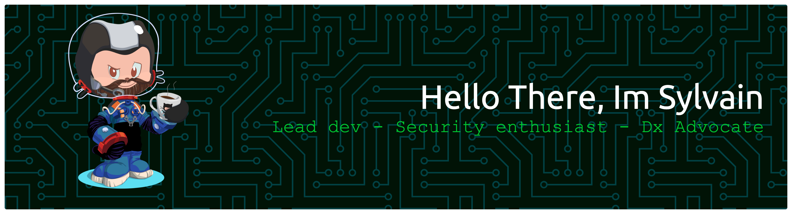

  
  
  

  
  Consultant at <a href="https://zenika.com/en-US">Zenika</a>

#### learning...

## Public contributions

metrics powered by <a href="https://github.com/lowlighter">lowlighter</a> 
make your own: <a href="https://github.com/lowlighter/metrics">https://github.com/lowlighter/metrics</a>

